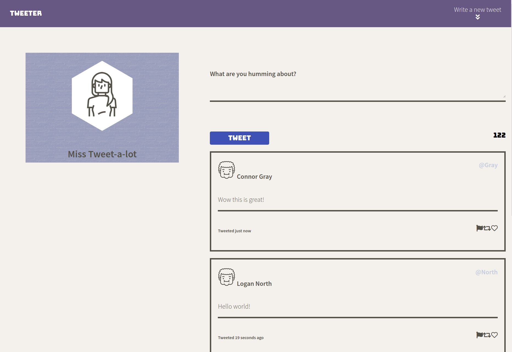

# Tweeter Project

Tweeter is a simple, single-page Twitter clone with simple functionality.

## How it looks

## Getting Started

1. Fork this repository, then clone your fork of this repository.
2. Install dependencies using the `npm install` command.
3. Start the web server using the `npm run local` command. The app will be served at <http://localhost:8080/>.
4. Go to <http://localhost:8080/> in your browser.

## Dependencies

- Express
- Node 5.10.x or above
- Body parser1.19.0
- Chance 1.1.8
- Express 4.17.1
- md 52.3.0
- Timeago.js 4.0.2

## App Functionality

- Click on the button below 'Write a new tweet' and tweet away to your heart's content!
- But do keep the character limit in mind as *'We can only take so much humming'*.
- Once you are done submitting a valid tweet, click on the top right button again to make the *text iput field* go away.
- This app's design has been made responsive to various different screens (i.e mobile, tablet and large monitor)
- After posting your tweet it shall appear below with details on when its been posted. 

**It is a simple App which focuses mainly on frontend development i.e HTML, CSS, jQuery & AJAX. Take it for a spin, play around and hope you have fun!**